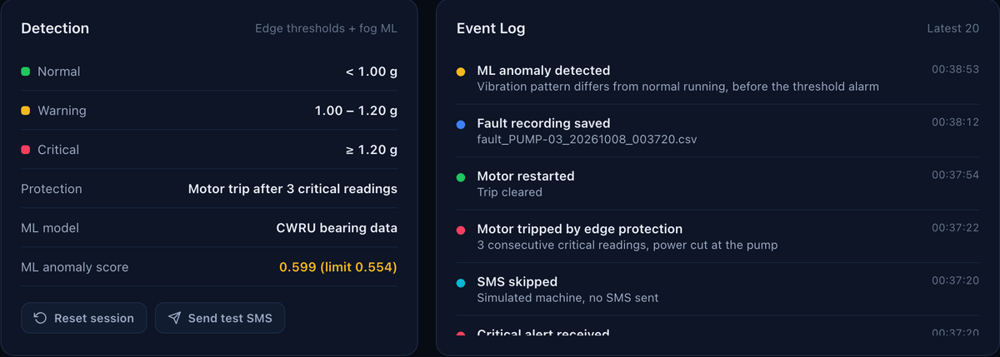

# ResQFog

Edge–fog–cloud condition monitoring for water-supply pumping stations, with an ML anomaly model trained on real bearing data.

ResQFog is our project for BCSE313L (Fundamentals of Fog and Edge Computing) at VIT. An ESP32 with an MPU6050 accelerometer is mounted on each pump motor. Every second it records a short vibration window, raises a local alarm and trips the motor if the vibration stays critical, and sends the reading to a Flask "fog" server. The fog server runs an Isolation Forest on the vibration window to warn about abnormal patterns before the threshold is crossed, shows all pumps on one dashboard, records the readings around every fault, and sends alerts to the maintenance team on Telegram.


## Why pumping stations

Borewell pumps, sump pumps and the pumps that fill overhead tanks are usually spread out and nobody is stationed at them. Most mechanical faults (bearing wear, impeller imbalance, misalignment) show up first as a change in vibration, but at an unmanned site they are only noticed when the water stops. The network at these sites is also unreliable, so the protection runs on the ESP32 itself, and the fog and cloud add early warning and visibility on top.

## How detection works

**Layer 1 – thresholds on the ESP32** (works without any network)

| State | v = \|√(ax²+ay²+az²) − 1 g\| | Response |
|---|---|---|
| NORMAL | < 1.00 g | – |
| WARNING | 1.00 – 1.20 g | logged, amber on the dashboard |
| CRITICAL | ≥ 1.20 g | buzzer, Telegram alert, fault recording |
| TRIPPED | 3 CRITICAL readings in a row | motor power cut; restart by turning the knob to zero or from the dashboard |

**Layer 2 – ML anomaly detection on the fog server**

- The ESP32 records 256 readings at 500 Hz (MPU6050 with its 184 Hz low-pass filter) and sends them with each reading.
- The fog server computes the energy in 10 frequency bands (0–250 Hz) and scores it with an Isolation Forest.
- An anomaly is raised when 3 of the last 5 windows are abnormal. If the vibration level is still normal at that point, the dashboard shows an early warning.

The model is trained on the [CWRU bearing dataset](https://engineering.case.edu/bearingdatacenter), after filtering and resampling it to what the MPU6050 can actually measure. On held-out data:

| Isolation Forest (trained on normal data only) | |
|---|---|
| Fault windows detected | 97.7 % |
| False alarms on normal windows | 0.7 % |
| Precision / F1 / ROC AUC | 0.999 / 0.988 / 0.999 |
| Random Forest reference, trained on 0–2 hp and tested on 3 hp | 87.4 % accuracy |

Full numbers are in [ml/results.json](ml/results.json). Shape features such as kurtosis and crest factor only reached about 15 % detection at this bandwidth, which is why the model uses band energies.



Every pump is different, so a real pump is **calibrated** with the "Calibrate ML" button: it fits the same kind of model to about 2 minutes of that pump's normal running. Simulated pumps in demo mode replay real CWRU windows and use the CWRU model.

## Other features

- **Fleet dashboard** – card per pump, live graph, statistics, event log, system health; works on a phone.
- **Telegram alerts** – free, with the full details: pump ID, site, reading and thresholds, motor state, ML score, time, GPS location with a Google Maps link and a map pin, and LoRa signal quality. Sent for critical vibration, a motor trip and an ML early warning, at most once per minute per pump and alert type, to one or more chats or a group.

  ```
  ResQFog ALERT: CRITICAL vibration
  Pump: PUMP-01 (VIT Main Sump)
  Vibration: 1.31 g (warning 1.00 g, critical 1.20 g)
  Motor: running at 78 %
  ML check: anomaly (score 0.621, limit 0.584)
  Time: 08 Oct 2026, 14:02:11
  Location: 12.96920, 79.15590 (GPS fix, 7 satellites)
  Map: open in Google Maps
  Action: Inspect the pump. The ESP32 trips the motor if this lasts 3 readings.
  ```
- **Offline buffer** – if the fog server can't be reached, the ESP32 keeps up to 300 readings (5 minutes) and uploads them later.
- **Fault recordings** – 50 readings before and 50 after every new fault, saved as CSV in `fault_logs/`.

## Hardware

| Component | Connection to ESP32 |
|---|---|
| MPU6050 accelerometer | SDA GPIO 21, SCL GPIO 22 (address 0x68) |
| 16×2 LCD with I²C backpack | same I²C bus (address 0x27) |
| Potentiometer (speed / trip reset) | GPIO 34 |
| L298N motor driver | ENA GPIO 25, IN1 GPIO 26, IN2 GPIO 27 |
| Buzzer | GPIO 32 |

About ₹1,050 per node with hobby modules.

## Optional modules: GPS and LoRa

Both are switched off by default (`USE_GPS` and `USE_LORA` at the top of the sketch), so the basic node works as described above. The code compiles for all four combinations; the modules still have to be tested with the hardware.

| Module | Wiring | What changes |
|---|---|---|
| NEO-6M GPS (`USE_GPS 1`, library TinyGPSPlus) | GPS TX → GPIO 16, GPS RX → GPIO 17, 9600 baud | Each reading carries latitude/longitude, a GPS-fix flag and satellites. Without a fix the node sends `SITE_LAT`/`SITE_LON`. The dashboard shows the location and the Telegram alert gets a map link and a map pin. |
| SX1278 LoRa (`USE_LORA 1`, library LoRa) | SCK 18, MISO 19, MOSI 23, NSS 5, RST 14, DIO0 2 | For sites without Wi-Fi. The node computes the 10 band energies itself (`band_features.h`) and sends a 36-byte packet (`lora_packet.h`) every 30 s and at once on a state change, so about 20 pumps can share one gateway at SF7. Protection still runs every second. |

With LoRa, a second ESP32 + SX1278 runs `edge/resqfog_lora_gateway` next to the fog server. It forwards each packet to `/data` (features in `"f"`, plus RSSI and SNR) and sends restart commands back to the node right after its next packet. `python3 ml/check_band_features.py` checks the on-device feature code against the Python version (same anomaly decision on all 120 test windows).

## Setup

### Edge node

1. Open `edge/resqfog_edge/resqfog_edge.ino` in Arduino IDE (ESP32 board package installed).
2. Install **LiquidCrystal_I2C** from the Library Manager.
3. Copy `secrets.example.h` to `secrets.h` in the same folder and set the Wi-Fi name, password and `FOG_SERVER` (the IP of the laptop running the fog server; on macOS `ipconfig getifaddr en0`).
4. Set `MACHINE_ID` and `SITE_NAME` for the pump, upload, and open the Serial Monitor at 115200.

### Fog server

```bash
pip install -r requirements.txt
cp .env.example .env      # Telegram bot token and chat ID (optional)
python3 fog_server.py
```

### Telegram alerts (free)

1. In Telegram, open **@BotFather**, send `/newbot`, choose a name, and copy the token into `TELEGRAM_BOT_TOKEN` in `.env`.
2. Send any message to the new bot from the phone that should get alerts. For a team, create a group, add the bot and post one message there.
3. Run `python3 fog_server.py --find-chat-id` and copy the number into `TELEGRAM_CHAT_ID` (several chats can be separated by commas).
4. Start the server and press **Send test alert** on the dashboard.

Open `http://127.0.0.1:5001`, or `http://<laptop-ip>:5001` from a phone on the same network. Then select the pump and press **Calibrate ML** while it runs normally (change the speed a little during the 2 minutes).

| Command | What it runs |
|---|---|
| `python3 fog_server.py` | Real edge nodes, real alerts |
| `python3 fog_server.py --fleet` | Real ESP32 as PUMP-01 plus three simulated pumps |
| `python3 fog_server.py --demo` | Four simulated pumps, no hardware, no alerts |
| `python3 fog_server.py --find-chat-id` | Lists the Telegram chats that messaged the bot (setup) |

### Retraining the model

```bash
python3 ml/train.py
```

This downloads the CWRU files it needs (about 100 MB) into `ml/data/`, and writes `ml/model.joblib`, `ml/results.json` and `ml/replay.npz`.

`python3 ml/experiments.py` runs the extra experiments (feature ablation, detector comparison, 10 seeds, leave-one-load-out, 12 kHz vs MPU6050 bandwidth, timing) and writes `ml/experiments.json`.

The thresholds are in two places and must match: the top of `fog_server.py` and the sketch (1.00 g and 1.20 g).

## Fog server API

| Endpoint | Purpose |
|---|---|
| `POST /data` | One reading: id, site, vibration, motorSpeed, status, motor, and either `w` (256 values in milli-g) or `f` (10 band energies, from a LoRa node). Optional lat, lon, gps, sats, via, rssi, snr. The reply may contain `"command": "RESET_TRIP"` |
| `POST /data/batch` | Readings buffered during an outage, each with its age in ms |
| `POST /alert` | Critical alert, triggers the Telegram message |
| `GET /api/status?machine=PUMP-01` | All pumps plus details of one pump, including its ML state |
| `POST /api/calibrate` | `{"machine": "PUMP-01"}` – fit the ML model to this pump |
| `POST /api/command` | `{"machine": "PUMP-01", "command": "RESET_TRIP"}` |
| `POST /api/reset` | Clear statistics for one pump |
| `GET /faults/<file>` | Download a fault CSV |

## Project structure

```
fog_server.py               Flask fog server and pump simulator
templates/dashboard.html    dashboard
static/                     Chart.js, served locally
ml/features.py              band-energy features (used for training and live)
ml/train.py                 downloads CWRU data, trains and evaluates the model
ml/experiments.py           ablation, detector comparison, seeds, cross-load, bandwidth
ml/check_band_features.py   checks the ESP32 feature code against Python
ml/model.joblib             trained model
ml/results.json             evaluation results
edge/resqfog_edge/          ESP32 firmware (optional GPS and LoRa modules)
edge/resqfog_lora_gateway/  ESP32 + SX1278 gateway for LoRa nodes
docs/                       presentation, screenshots, related work, sample data
```

## Limitations

- The MPU6050 bandwidth (184 Hz) cannot capture the high-frequency impacts of early bearing faults; the model relies on low-frequency band energy.
- In CWRU, healthy and faulty bearings were recorded separately, so part of the difference may come from the recordings themselves (see Smith and Randall, 2015).
- The model has not yet been tested on faults induced on our own rig. That is the next step, together with a current sensor for dry-running detection.

Comparison with existing work: [docs/related_work.md](docs/related_work.md).

## Team

Arush Mishra (23BCT0199) and Abuzar Siddiqi (23BCT0186)
Faculty: Prof. Kauser Ahmed P
