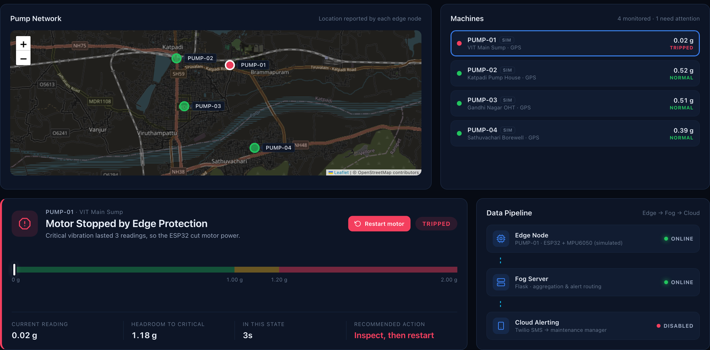
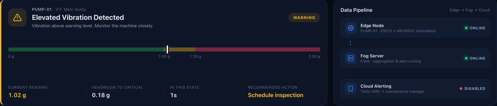
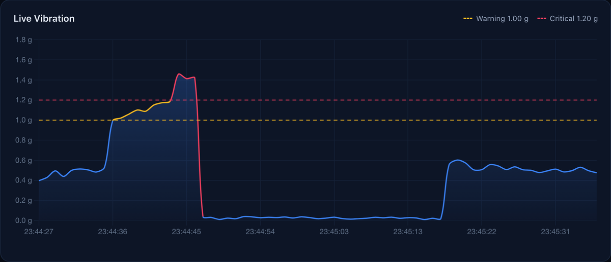

# ResQFog

Edge–fog–cloud condition monitoring for water-supply pumping stations.

ResQFog is our project for BCSE313L (Fundamentals of Fog and Edge Computing) at VIT. An ESP32 with an MPU6050 accelerometer is mounted on each pump motor. It measures vibration every second, sounds a local alarm and trips the motor if the vibration stays critical, and sends its readings to a Flask "fog" server. The fog server shows every pump on a live dashboard with a map, records the readings around each fault, and sends an SMS to the maintenance engineer through Twilio.



## Why pumping stations

Borewell pumps, sump pumps and the pumps that fill overhead tanks are usually spread over a few kilometres and nobody is stationed at them. Most mechanical faults (bearing wear, impeller imbalance, misalignment, cavitation) show up first as higher vibration, but at an unmanned site they are only noticed when the water stops. The network at these sites is also unreliable, so we wanted the protection to work on the ESP32 itself and the fog/cloud parts to add visibility on top of it.

The node itself is not pump-specific and can be put on any rotating machine.

## What it does

- **Edge alarm and motor trip** – the ESP32 classifies every reading. CRITICAL turns on the buzzer, and 3 CRITICAL readings in a row cut motor power. None of this needs the network.
- **Pump identification** – every message carries the pump ID, site name and GPS position (NEO-6M). Without a GPS fix the node sends the coordinates set at installation.
- **SMS with location** – on a new CRITICAL event the fog server sends an SMS with the pump ID, reading and a Google Maps link (one SMS per minute per pump at most).
- **Remote restart** – after a trip, the dashboard can send a restart command. It goes back to the ESP32 in the reply to its next reading. Locally, turning the speed knob to zero also clears the trip.
- **Offline buffer** – if the fog server can't be reached, the ESP32 keeps up to 300 readings (5 minutes) and uploads them later with their age, so the graph has no gap.
- **Fault recordings** – 50 readings before and 50 after every new fault are saved as a CSV in `fault_logs/`.
- **Fleet dashboard** – map of all pumps, per-pump status, live graph, statistics, event log, system health. Works on a phone too.

## Architecture

```
  EDGE (one per pump)                 FOG (laptop / PC)                 CLOUD
  ESP32 + MPU6050 + GPS   --/data-->  Flask server        --HTTPS-->   Twilio SMS --> engineer
  buzzer, LCD, motor      --/alert->  dashboard + map
  offline buffer          --/data/batch->  fault CSVs
                          <-- restart command (in reply) --
```

## Hardware

| Component | Connection to ESP32 |
|---|---|
| MPU6050 accelerometer (±2 g) | SDA GPIO 21, SCL GPIO 22 (address 0x68) |
| 16×2 LCD with I²C backpack | same I²C bus (address 0x27) |
| NEO-6M GPS | GPS TX → GPIO 16, GPS RX → GPIO 17, 9600 baud |
| Potentiometer (speed / trip reset) | GPIO 34 |
| L298N motor driver | ENA GPIO 25, IN1 GPIO 26, IN2 GPIO 27 |
| Buzzer | GPIO 32 |

The GPS is optional. Without it (or indoors, where it usually gets no fix) the node uses `SITE_LAT` / `SITE_LON` from the sketch.

## Setup

### Edge node

1. Open `edge/resqfog_edge/resqfog_edge.ino` in Arduino IDE (ESP32 board package installed).
2. Install the libraries **LiquidCrystal_I2C** and **TinyGPSPlus** from the Library Manager.
3. Copy `secrets.example.h` to `secrets.h` in the same folder and set the Wi-Fi name, password and `FOG_SERVER` (the IP of the laptop running the fog server; on macOS `ipconfig getifaddr en0`).
4. Set `MACHINE_ID`, `SITE_NAME`, `SITE_LAT` and `SITE_LON` for the pump.
5. Upload and open the Serial Monitor at 115200.

### Fog server

```bash
pip install -r requirements.txt
cp .env.example .env      # fill in the Twilio values
python3 fog_server.py
```

Open `http://127.0.0.1:5001` (or `http://<laptop-ip>:5001` from a phone on the same network).

Run modes:

| Command | What it runs |
|---|---|
| `python3 fog_server.py` | Real edge nodes, real SMS |
| `python3 fog_server.py --fleet` | Real ESP32 as PUMP-01 plus three simulated pumps on the map |
| `python3 fog_server.py --demo` | Four simulated pumps, no hardware, no SMS |

If Twilio credentials are missing the server still runs, with SMS shown as disabled. Set `SMS_MODE=template` in `.env` to send the short fixed text we used during the first SMS tests instead of the detailed message.

The thresholds are in two places and must match: `WARNING_THRESHOLD` / `CRITICAL_THRESHOLD` at the top of `fog_server.py` and in the sketch (currently 1.00 g and 1.20 g).

## Fog server API

| Endpoint | Used by | Purpose |
|---|---|---|
| `POST /data` | ESP32 | One reading (id, site, vibration, motorSpeed, status, motor, lat, lon, gps, sats). Reply may contain `"command": "RESET_TRIP"` |
| `POST /data/batch` | ESP32 | Readings buffered during an outage, each with its age in ms |
| `POST /alert` | ESP32 | Critical alert, triggers the SMS |
| `GET /api/status?machine=PUMP-01` | Dashboard | Fleet list plus details of one pump |
| `POST /api/command` | Dashboard | `{"machine": "PUMP-01", "command": "RESET_TRIP"}` |
| `POST /api/reset` | Dashboard | Clear statistics for one pump |
| `GET /faults/<file>` | Dashboard | Download a fault CSV |
| `GET/POST /test-sms` | Dashboard | Send a test SMS |

## Detection

```
v = | sqrt(ax² + ay² + az²) − 1 g |
```

| State | v | Response |
|---|---|---|
| NORMAL | < 1.00 g | – |
| WARNING | 1.00 – 1.20 g | logged, amber on the dashboard |
| CRITICAL | ≥ 1.20 g | buzzer, SMS, fault recording |
| TRIPPED | 3 CRITICAL readings in a row | motor power cut |

On our test rig normal running averages about 0.1 g with short peaks around 1.0 g. With the ±2 g range the largest possible reading is about 2.46 g (all three axes at full scale), so readings close to that usually mean the sensor was knocked.

## Project structure

```
fog_server.py                 Flask fog server, simulator
templates/dashboard.html      dashboard (HTML/CSS/JS)
static/                       Chart.js and Leaflet, served locally
edge/resqfog_edge/            ESP32 firmware
docs/                         presentation, screenshots, sample data
fault_logs/                   fault CSVs (created at runtime, not in git)
```

## Screenshots

| Warning state | Live graph (warning → critical → trip → restart) |
|---|---|
|  |  |

Phone view and fault recordings: [docs/images](docs/images).

`docs/sample_data/` has a real fault recording from our rig (101 rows, from before the `machine_id` column was added).

## Limitations and next steps

- One reading per second gives the vibration level, not its frequency content, so the threshold cannot tell different faults apart.
- Thresholds have to be tuned per pump.
- GPS needs a view of the sky.
- Map tiles come from OpenStreetMap, so the map needs internet; the rest of the dashboard works offline.

Next we want to add a current sensor (dry running, overload) and a GSM module for sites without Wi-Fi. Phase 2 replaces the thresholds with an autoencoder on the ESP32 and a Random Forest on the fog server that names the fault type. The details are in the presentation in `docs/`.

## Team

Arush Mishra (23BCT0199) and Abuzar Siddiqi (23BCT0186)
Faculty: Prof. Kauser Ahmed P
