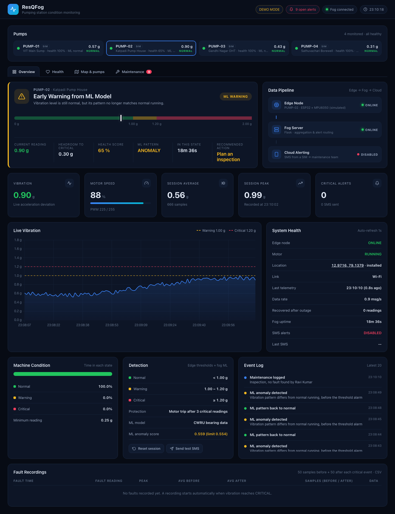
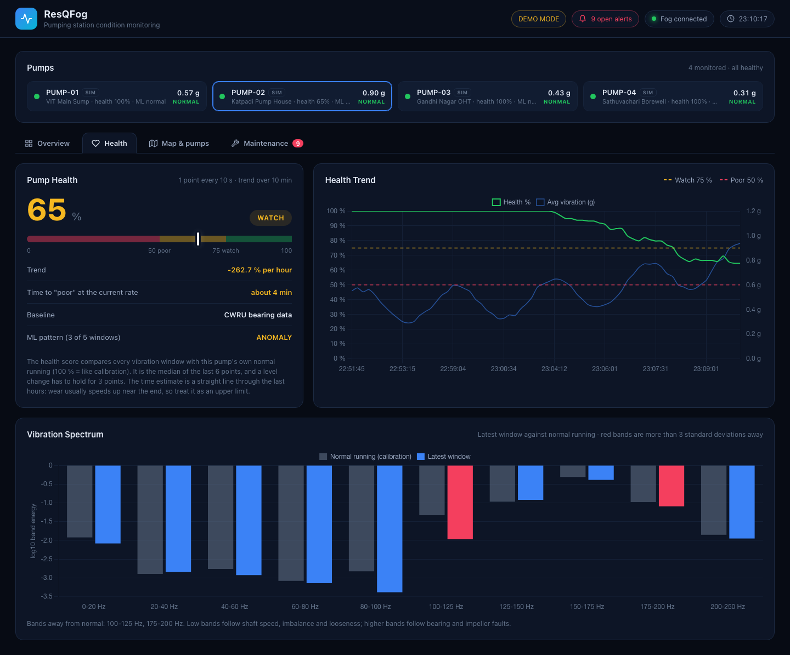
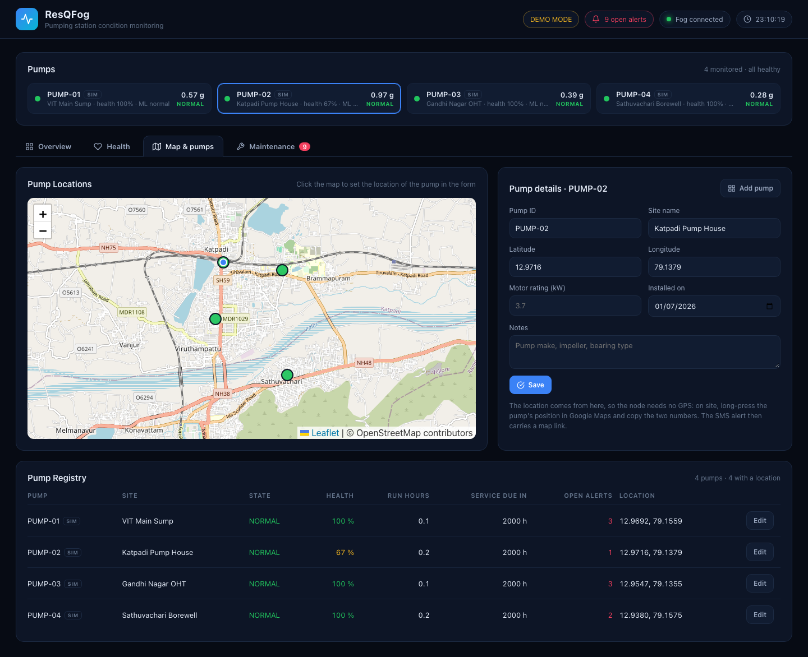
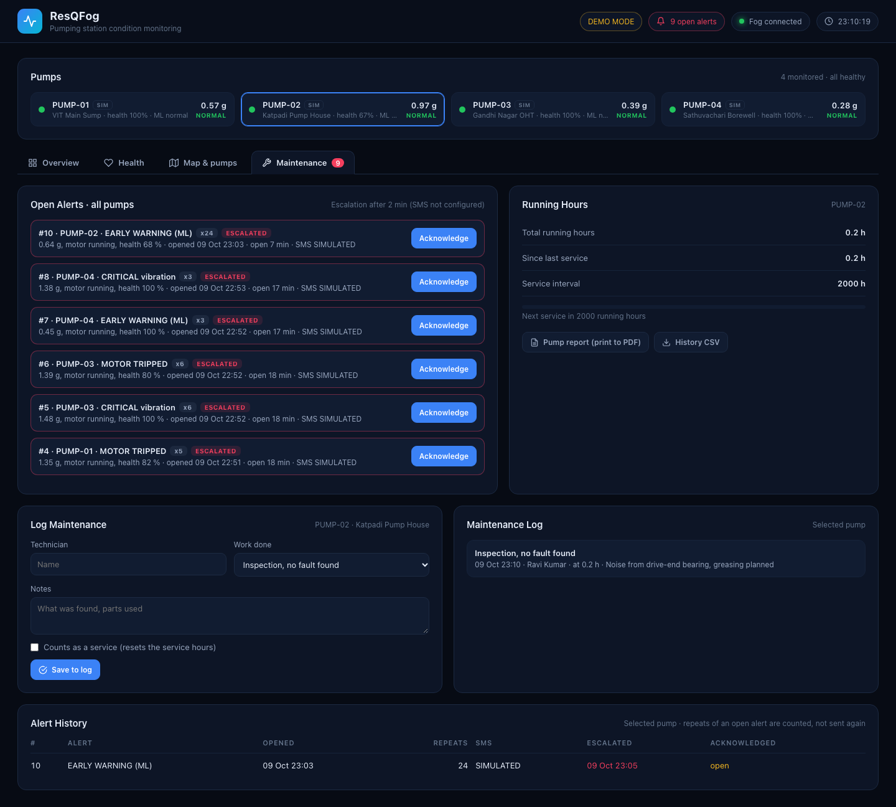

# ResQFog

Edge–fog condition monitoring and maintenance for water-supply pumping stations, with ML early warning and a pump health score tested on real bearing data.

ResQFog is our project for BCSE313L (Fundamentals of Fog and Edge Computing) at VIT. An ESP32 with an MPU6050 accelerometer is mounted on each pump motor. Every second it records a short vibration window, raises a local alarm and trips the motor if the vibration stays critical, and sends the reading to a Flask "fog" server in the pump office. The fog server runs an Isolation Forest and a health score on the vibration window, shows every pump on one dashboard and on a map, keeps the health history and a maintenance log, and sends SMS alerts that have to be acknowledged or they are escalated.



## Why pumping stations

Borewell pumps, sump pumps and the pumps that fill overhead tanks are usually spread out and nobody is stationed at them. Most mechanical faults (bearing wear, impeller imbalance, misalignment) show up first as a change in vibration, but at an unmanned site they are only noticed when the water stops. The network at these sites is also unreliable, so the protection runs on the ESP32 itself, and the fog adds early warning, trends and the maintenance workflow on top.

## How detection works

**Layer 1 – thresholds on the ESP32** (works without any network)

| State | v = \|√(ax²+ay²+az²) − 1 g\| | Response |
|---|---|---|
| NORMAL | < 1.00 g | – |
| WARNING | 1.00 – 1.20 g | logged, amber on the dashboard |
| CRITICAL | ≥ 1.20 g | buzzer, SMS alert, fault recording |
| TRIPPED | 3 CRITICAL readings in a row | motor power cut; restart by turning the knob to zero or from the dashboard |

**Layer 2 – ML anomaly detection on the fog server**

- The ESP32 records 256 readings at 500 Hz (MPU6050 with its 184 Hz low-pass filter) and sends them with each reading.
- The fog server computes the energy in 10 frequency bands (0–250 Hz) and scores it with an Isolation Forest.
- An anomaly is raised when 3 of the last 5 windows are abnormal. If the vibration level is still normal at that point, the dashboard shows an early warning.

The model is trained on the [CWRU bearing dataset](https://engineering.case.edu/bearingdatacenter), after filtering and resampling it to what the MPU6050 can actually measure. On held-out data:

| Isolation Forest (trained on normal data only) | |
|---|---|
| Fault windows detected | 97.7 % |
| False alarms on normal windows | 0.7 % |
| Precision / F1 / ROC AUC | 0.999 / 0.988 / 0.999 |
| Random Forest reference, trained on 0–2 hp and tested on 3 hp | 87.4 % accuracy |

Full numbers are in [ml/results.json](ml/results.json). Shape features such as kurtosis and crest factor only reached about 15 % detection at this bandwidth, which is why the model uses band energies.

Every pump is different, so a real pump is **calibrated** from the dashboard: the same kind of model is fitted to that pump's own normal running, either in 2 minutes or over an hour (one window every 30 s, which covers more of its normal variation). Simulated pumps in demo mode replay real CWRU windows and use the CWRU model.

**Pump health score – how far the pump has moved from its own normal running**

The anomaly model answers "is this window abnormal?". The health score answers "how worn is this pump, and is it getting worse?". For each window the fog measures the distance of its band energies from the calibration windows (Mahalanobis distance, divided by the 95th percentile of calibration), and maps it to 0–100 % on a log scale. One point is stored per minute (the median of the last 6), and the level changes when it holds for 3 points: **good** above 75 %, **watch** 50–75 %, **poor** below 50 % (sends an SMS). A straight line through the last 6 hours gives the time until "poor" at the current rate.

We tested this on the [IMS bearing dataset](https://www.nasa.gov/intelligent-systems-division/discovery-and-systems-health/pcoe/pcoe-data-set-repository/): bearings run on a test rig until they failed, recorded every 10 minutes for 7 to 45 days. Every recording went through the same MPU6050 filtering as above, and each bearing was calibrated on 120 windows from its first day:

| Failed bearing | Health below 75 % (watch) | Below 50 % (poor) | Same score on full 20 kHz signal | RMS above calibration + 3 sd |
|---|---|---|---|---|
| Test 1, bearing 3 (inner race) | 185 h before failure | 9.5 h | 611 h | 656 h |
| Test 1, bearing 4 (roller) | not detected | – | 125 h | 656 h |
| Test 2, bearing 1 (outer race) | 2.8 h | 1.5 h | 56 h | 74 h |
| Test 3, bearing 3 (outer race) | 11.3 h | 2.2 h | 51 h | 59 h |
| **False alarms on the 8 healthy bearings** (more than 48 h before the end) | **0** | **0** | 2 | 4 |

So at the MPU6050's bandwidth the score never raised a false alarm, warned before 3 of the 4 failures, but often only hours before. A wide-band sensor warns days earlier but with more false alarms. The time estimate was off by about 80 % (median) and was too optimistic for the outer-race failures, because wear speeds up near the end, so the dashboard shows it as an upper limit. Numbers in [ml/ims_results.json](ml/ims_results.json).

## Dashboard

| Tab | What it shows |
|---|---|
| Overview | Live state of the selected pump, vibration graph, KPIs, system health, event log, fault recordings, motor restart |
| Health | Health score and level, trend per day, time to "poor", health history, and the latest spectrum against normal running with the abnormal bands in red |
| Map & pumps | Every pump on an OpenStreetMap map coloured by state, the pump registry (site, location, motor rating, installation date, running hours) and a form to add or edit a pump; click the map to set its location |
| Maintenance | Open alerts of all pumps with an Acknowledge button, alert history, running hours and next service, the maintenance log, and a printable pump report and history CSV |







## Alerts, acknowledgement and escalation

Alerts are sent for critical vibration, a motor trip, an ML early warning and a pump whose health becomes poor. Each one is logged as an open alert until someone acknowledges it on the dashboard; repeats while it is open only raise its count. If nobody acknowledges it within 10 minutes (`ESCALATE_AFTER`), it is sent again to the supervisor numbers in `SMS_ESCALATE_TO`.

The SMS is sent from an ordinary SIM card, so it carries the full details and needs no app on the receiving phone:

```
ResQFog ALERT: CRITICAL vibration
Pump: PUMP-07 (Bagayam Sump)
Vibration: 1.31 g (critical 1.20 g)
Motor: running 78%
ML: normal, score 0.47/0.55
Health: 81% (good)
Time: 09-Oct 22:46:12
Location: 12.93421,79.13310 (installed)
Map: https://maps.google.com/?q=12.93421,79.13310
Inspect the pump. Motor trips if this lasts 3 readings.
```

The location comes from the pump registry, so the node needs no GPS. SMS APIs in India only allow pre-registered templates, so the alert is sent through an Android phone running the free SMSGate app (default), or through a GSM module. A template-based CircuitDigest option is also included.

## What the fog tier saves

Measured with `python3 tools/fog_eval.py` on our laptop (results in [tools/fog_eval.json](tools/fog_eval.json)):

| | |
|---|---|
| One reading with its window (JSON body from the node) | 1,383 bytes, 119.5 MB per pump per day |
| What the fog keeps (one point per minute in SQLite) | about 115 kB per pump per day |
| A cloud copy of the per-minute summaries would need | 164 kB per pump per day (99.86 % less than raw) |
| Fog round trip of a reading, including features, ML and health | 2.4 ms median (3.0 ms p95), plus 3.5 ms Wi-Fi hop to the router |
| HTTPS round trip to the nearest cloud region (AWS Mumbai) | 164 ms with a new connection, 55 ms with a kept-open one |
| Readings the fog handles per second (20 pumps sending flat out) | about 367, so one laptop can serve a few hundred pumps at 1 Hz |

And when the internet is down, the alarm, the motor trip, the dashboard and the SMS from the local phone all keep working.

## Other features

- **Offline buffer** – if the fog server can't be reached, the ESP32 keeps up to 300 readings (5 minutes) and uploads them later.
- **Fault recordings** – 50 readings before and 50 after every new fault, saved as CSV in `fault_logs/`.
- **Pump report** – one page per pump with health history, alerts, acknowledgements, maintenance and faults; print it to PDF from the browser.
- **Running hours** – counted while the motor runs; logging a service resets the hours until the next service (`SERVICE_EVERY_HOURS`, default 2000).

## Hardware

| Component | Connection to ESP32 |
|---|---|
| MPU6050 accelerometer | SDA GPIO 21, SCL GPIO 22 (address 0x68) |
| 16×2 LCD with I²C backpack | same I²C bus (address 0x27) |
| Potentiometer (speed / trip reset) | GPIO 34 |
| L298N motor driver | ENA GPIO 25, IN1 GPIO 26, IN2 GPIO 27 |
| Buzzer | GPIO 32 |

About ₹1,040 per node with hobby modules. On a real pump the L298N is replaced by a relay driving the motor contactor.

## Setup

### Edge node

1. Open `edge/resqfog_edge/resqfog_edge.ino` in Arduino IDE (ESP32 board package installed).
2. Install **LiquidCrystal_I2C** from the Library Manager.
3. Copy `secrets.example.h` to `secrets.h` in the same folder and set the Wi-Fi name, password and `FOG_SERVER` (the IP of the laptop running the fog server; on macOS `ipconfig getifaddr en0`).
4. Set `MACHINE_ID` and `SITE_NAME` for the pump, upload, and open the Serial Monitor at 115200.

### Fog server

```bash
pip install -r requirements.txt
cp .env.example .env      # SMS settings (optional)
python3 fog_server.py
```

Open `http://127.0.0.1:5001`, or `http://<laptop-ip>:5001` from a phone on the same network. Then:

1. On **Map & pumps**, select the pump, enter its site and location (click the map, or long-press the pump in Google Maps on site and copy the two numbers) and save.
2. On **Health**, press **Calibrate** while the pump runs normally (change the speed a little).
3. Alerts appear under **Maintenance**; acknowledge them there, and log the work done.

The registry, health history, alerts and maintenance log are kept in `resqfog.db` next to the server. A pump calibrated with an older version needs to be calibrated again to get a health score.

| Command | What it runs |
|---|---|
| `python3 fog_server.py` | Real edge nodes, real alerts |
| `python3 fog_server.py --fleet` | Real ESP32 as PUMP-01 plus three simulated pumps |
| `python3 fog_server.py --demo` | Four simulated pumps, no hardware, no SMS, nothing saved; PUMP-02 wears out over 15 minutes (log a service on it to replace the bearing) |
| `python3 fog_server.py --test-sms` | Sends one test SMS with the settings in `.env` |

### SMS alerts

Put the numbers to alert in `SMS_TO` in `.env` (with country code, several separated by commas; if empty, `MANAGER_PHONE` is used), and the supervisor numbers in `SMS_ESCALATE_TO`. Then set up the sender.

**SMSGate on an Android phone (default).** Any Android 5+ phone with a SIM and an SMS pack works; an old phone is fine. Only this phone needs the app, the people receiving get a normal SMS.

1. Download and install the APK from [sms-gate.app](https://sms-gate.app) (free, open source, no account needed).
2. Open the app, turn on **Local Server** and keep the phone on the same Wi-Fi as the fog computer.
3. Copy the address shown in the app (for example `http://192.168.1.20:8080`), the username and the password into `SMS_GATEWAY_URL`, `SMS_GATEWAY_USER` and `SMS_GATEWAY_PASSWORD`.

The phone sends the full alert shown above from its own SIM, so the text is not limited to a template. Prepaid plans in India usually include about 100 SMS a day, which is plenty with one alert per pump and type per minute.

**GSM module (permanent installation).** Connect an A7670C (4G) or SIM800L module with a SIM to the fog computer through a USB-serial adapter, set `SMS_BACKEND=gsm` and `GSM_PORT` (for example `/dev/tty.usbserial-0001`, or `COM3` on Windows). The SIM800L only works on 2G, so it needs an Airtel or Vi SIM; the A7670C also works with Jio. Needs `pip install pyserial`. Long alerts are sent as two SMS parts.

**CircuitDigest Cloud (no phone or module).** A free SMS API for makers in India: set `SMS_BACKEND=circuitdigest`, sign up at [circuitdigest.cloud](https://www.circuitdigest.cloud), verify each receiving number with the OTP (up to 5) and copy the API key into `CIRCUITDIGEST_API_KEY`. It only sends fixed templates with two short fields, so the alert arrives in their wording without the map link, and the free plan allows 100 SMS a month (alerts limited to one every 10 minutes):

```
The pump PUMP01 VIT Main Sump requires maintenance. Detected issue: critical vibration 1.31g.
The device pump PUMP01 is currently located at 12.96920 79.15590.
```

Check the settings with `python3 fog_server.py --test-sms` or the **Send test SMS** button on the dashboard.

### Models and experiments

```bash
python3 ml/train.py           # CWRU: downloads ~100 MB into ml/data/, writes model.joblib, results.json, replay.npz
python3 ml/experiments.py     # feature ablation, detectors, 10 seeds, leave-one-load-out, bandwidth, timing
python3 ml/ims_health.py      # health score on the IMS run-to-failure data -> ml/ims_results.json
python3 tools/fog_eval.py     # data volume, fog and cloud latency, capacity -> tools/fog_eval.json
```

For `ims_health.py`, download [4. Bearings.zip](https://phm-datasets.s3.amazonaws.com/NASA/4.+Bearings.zip) (1.1 GB) from the NASA Prognostics Data Repository, extract `IMS.7z` and the three `.rar` files inside it, and put the folders in `ml/data/ims/` as `1st_test`, `2nd_test` and `3rd_test` (the third one is called `4th_test/txt` in the archive).

The thresholds are in two places and must match: the top of `fog_server.py` and the sketch (1.00 g and 1.20 g).

## Fog server API

| Endpoint | Purpose |
|---|---|
| `POST /data` | One reading: id, site, vibration, motorSpeed, status, motor, and either `w` (256 values in milli-g) or `f` (10 band energies). The reply may contain `"command": "RESET_TRIP"` |
| `POST /data/batch` | Readings buffered during an outage, each with its age in ms |
| `POST /alert` | Critical alert, triggers the SMS |
| `GET /api/status?machine=PUMP-01` | All pumps plus details of one pump: ML, health, spectrum, hours, alerts, maintenance |
| `GET /api/pumps`, `POST /api/pumps` | Pump registry: list, or add/edit `{"id", "site", "lat", "lon", "motorKw", "installed", "notes"}` |
| `GET /api/alerts?open=1` | Alerts (all, or only open ones) |
| `POST /api/alerts/<id>/ack` | `{"by": "Ravi", "note": "going to site"}` |
| `POST /api/maintenance` | `{"machine", "technician", "action", "notes", "service": true}` |
| `POST /api/calibrate` | `{"machine": "PUMP-01", "mode": "quick" or "long"}` |
| `POST /api/command` | `{"machine": "PUMP-01", "command": "RESET_TRIP"}` |
| `POST /api/reset` | Clear statistics for one pump |
| `GET /report/<pump>`, `GET /report/<pump>.csv` | Printable pump report, stored history as CSV |
| `GET /faults/<file>` | Download a fault CSV |

## Project structure

```
fog_server.py               Flask fog server, alerts, escalation and pump simulator
store.py                    SQLite: pump registry, health history, alerts, maintenance log
templates/dashboard.html    dashboard (Overview, Health, Map & pumps, Maintenance)
templates/report.html       printable pump report
static/                     Chart.js and Leaflet, served locally
ml/features.py              band-energy features (used for training and live)
ml/health.py                pump health score and trend estimate
ml/train.py                 downloads CWRU data, trains and evaluates the model
ml/experiments.py           ablation, detector comparison, seeds, cross-load, bandwidth
ml/ims_health.py            health score on IMS run-to-failure data
ml/check_band_features.py   checks the ESP32 feature code against Python
tools/fog_eval.py           fog versus cloud measurements
edge/resqfog_edge/          ESP32 firmware
docs/                       screenshots, related work, sample data
```

## Experimental: GPS and LoRa

The firmware also has GPS (NEO-6M) and LoRa (SX1278) options with a LoRa gateway in `edge/resqfog_lora_gateway`, switched off by default (`USE_GPS`, `USE_LORA`). They are not part of the evaluated system: a GPS receiver needs open sky, which a pump house does not have, so the location is taken from the registry instead, and most pumping stations have Wi-Fi or mobile data near the pump office. LoRa remains future work for borewells far from any network.

## Limitations

- The MPU6050 bandwidth (184 Hz) cannot capture the high-frequency impacts of early bearing faults. On the IMS data this means warnings hours, not days, before an outer-race failure, and one roller failure was missed.
- In CWRU, healthy and faulty bearings were recorded separately, so part of the difference may come from the recordings themselves (see Smith and Randall, 2015).
- The time-to-poor estimate is a straight line and is too optimistic when wear speeds up.
- The models have not yet been tested on faults induced on our own rig. That is the next step, together with a current sensor for dry-running detection.

Comparison with existing work: [docs/related_work.md](docs/related_work.md).

## Team

Arush Mishra (23BCT0199) and Abuzar Siddiqi (23BCT0186)
Faculty: Prof. Kauser Ahmed P
